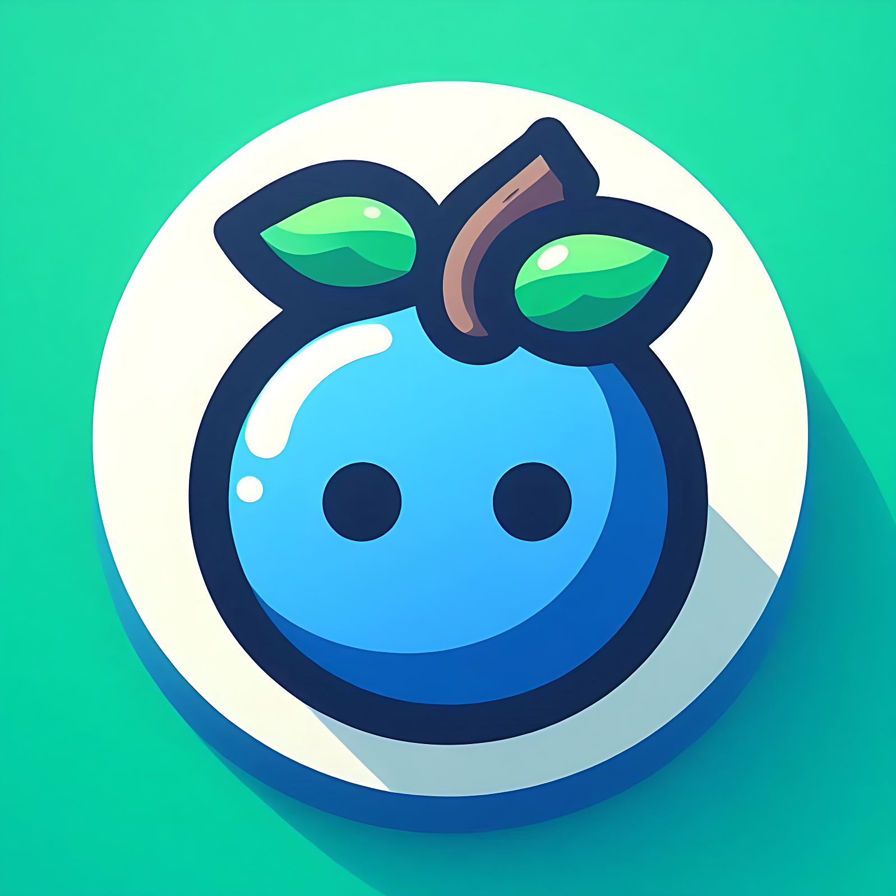

# Blubot 🤖



Blubot is a modular, multi-purpose Discord bot built with [discord.py].  
It bundles fun mini-games, utilities, timers, polls, weather, currency conversion, and a clean, embed-based help system.

Default prefix: **`%`**

---

## ✨ Key Features

- 📚 **Custom Help** — Clean, category-style help embeds (`%help`, `%help <command>`).
- 🧩 **Modular Cogs** — Each feature is isolated in its own cog for easy maintenance.
- 🕹️ **Fun & Social** — Slots, Magic 8-ball, random choices, theories, jokes, quotes.
- 🛠️ **Utilities** — Reminders, Pomodoro, To-Do lists, polls, weather, currency conversion.

---

## 📦 Requirements

- Python **3.10+** (recommended)
- A Discord bot token
- (Optional) OpenWeatherMap API key for the `%weather` command

Python dependencies (install via `pip`):
- `discord.py`
- `python-dotenv`
- `aiohttp`

---

## 🗂️ Project Structure

```
blubot/
├─ bot.py
├─ .env                   # You create this (see below)
└─ cogs/
   ├─ __init__.py
   ├─ bomb.py
   ├─ choose.py
   ├─ convert.py
   ├─ eightball.py
   ├─ poll.py
   ├─ quotes.py
   ├─ remindme.py
   ├─ slots.py
   ├─ theory.py
   ├─ timer.py
   ├─ todo.py
   └─ weather.py
```

---

## 🔐 Environment Variables (`.env`)

Create a `.env` file at the project root with your own tokens, replacing the placeholders in `.env.example`:

```
DISCORD_TOKEN=your_discord_bot_token_here
OPENWEATHER_API_KEY=your_openweathermap_api_key_here
```

- `DISCORD_TOKEN` — Required for the bot to connect to Discord.
**How to get it:**  
Go to the [Discord Developer Portal](https://discord.com/developers/applications), create a new application, then add a bot under that application. Copy the bot token and paste it here.  

- `OPENWEATHER_API_KEY` — Required only for `%weather`.
**How to get it:**  
Sign up at [OpenWeatherMap](https://openweathermap.org/api), create a free API key, and paste it here.


---

## 🤖 Discord Application Setup

1. Go to the [Discord Developer Portal] → **Applications** → **New Application**.
2. Create a **Bot** under the *Bot* tab.
3. **Copy the Token** and place it into your `.env` as `DISCORD_TOKEN`.
4. **Privileged Intents**: In the *Bot* tab, enable **Message Content Intent** (required for reading commands and message content).
5. Invite the bot to your server using an OAuth2 URL (Scopes: `bot`, `applications.commands`; Permissions: `Send Messages`, `Embed Links`, `Add Reactions`, `Read Message History` at minimum).

---

## 🚀 Installation & Running

```bash
# 1) Clone
git clone https://github.com/<your-username>/blubot.git
cd blubot

# 2) Create and activate a virtual environment (optional but recommended)
python -m venv .venv
# Windows:
.venv\Scripts\activate
# macOS/Linux:
source .venv/bin/activate

# 3) Install dependencies
pip install -r requirements.txt

# 4) Create .env (see example above) and set your tokens

# 5) Run the bot
python bot.py
```

When the bot is ready, the console prints:
```
✅ Logged in as <botname#1234>
```

---

## ⚙️ Configuration Notes

- **Prefix** is `%` (see `bot.py`: `commands.Bot(command_prefix="%", intents=intents)`).
- Cogs are auto-loaded from the `cogs/` folder on startup.
- If a cog fails to load, you’ll see a message in the console.

---

## 📖 Command Reference (A–Z)

Below are **all commands**, grouped roughly by category, with usage, examples, and notes.

### General

#### `%ping`
- **Description:** Check if the bot is online and view latency.
- **Usage:** ``%ping``
- **Example:** ``%ping``

#### `%help [command]`
- **Description:** Show the main help menu or detailed help for a specific command or command group.
- **Usage:** ``%help`` or ``%help <command>``
- **Notes:** Uses a custom embed-based help formatter.

---

### Random & Fun

#### `%slots`
- **Description:** Play a 3×3 animated emoji slot machine.
- **Usage:** ``%slots``
- **Example:** ``%slots``
- **Win Logic:** Any full horizontal line or either diagonal with matching emojis triggers a win.

#### `%8ball <question>`
- **Description:** Ask the magic 8-ball a question.
- **Usage:** ``%8ball <question>``
- **Example:** ``%8ball Will I pass the exam?``

#### `%choose <option_1> | <option_2> | ...`
- **Description:** Randomly select one of the provided options.
- **Usage:** ``%choose pizza | burger | sushi``
- **Notes:** Use the `|` separator; at least two options required.

#### `%if`
- **Description:** Get a random “If…” theory from a local text file.
- **Usage:** ``%if``
- **Notes:** Reads from `cogs/theories.txt` (one theory per line). If the file is missing or empty, the bot replies that no theories are found.

#### `%joke`
- **Description:** Fetch a random joke.
- **Usage:** ``%joke``

#### `%quote`
- **Description:** Fetch a random inspirational quote.
- **Usage:** ``%quote``

#### `%fact [num|cat]`
- **Description:** Fetch a random fact. Optionally use `num` for number trivia or `cat` for cat facts.
- **Usage:**
  - ``%fact``
  - ``%fact num``
  - ``%fact cat``

**APIs used in `quotes.py`**
- Facts: `uselessfacts.jsph.pl` (random), `numbersapi.com` (number trivia), `catfact.ninja` (cat facts)
- Jokes: `official-joke-api.appspot.com`
- Quotes: `zenquotes.io`
If any external API is unreachable or returns an error, the bot responds with a message.

---

### Utilities

#### `%convert <amount> <from_currency> <to_currency>`
- **Description:** Convert between currencies (ISO 4217 codes like USD, EUR, JPY).
- **Usage:** ``%convert 100 USD EUR``
- **Output:** Two decimals, e.g., `💵 100 USD = 92.45 EUR`
- **Notes:** Uses `https://open.er-api.com/v6/latest/<FROM>` for rates.

#### `%weather <city>`
- **Description:** Get current weather for a city.
- **Usage:** ``%weather Athens``
- **Notes:**
  - Requires `OPENWEATHER_API_KEY` in your `.env`.
  - Units are metric (°C), language is English.
  - If the API key is missing or the city is not found, the bot informs the user.

---

### Timers & Reminders

#### `%remindme <time_parts> <task>`
- **Description:** Set a reminder with a flexible duration.
- **Usage:** Provide time parts like `h`, `m`, `s` at the **start**, then the task text.
  - ``%remindme 5m 30s take food out of the oven``
  - ``%remindme 1h finish the report``
- **Limits:** Max 24 hours total.
- **Notes:** Reminders are in-memory and **won’t survive bot restarts**.

#### `%pomodoro <work_minutes> <break_minutes>`
- **Description:** Start a Pomodoro timer with work and break intervals.
- **Usage:**
  - ``%pomodoro`` (defaults to 25 work / 5 break)
  - ``%pomodoro 50 10``
- **Limits:** Max 120 minutes work, 60 minutes break.
- **Notes:** Simple one-cycle timer; uses messages to announce phase changes.

---

### Polls

#### `%poll <question> | <emoji_1> <option_1> | <emoji_2> <option_2> | ...`
- **Description:** Create a poll with 2+ options. If you don’t provide emojis, numbered emojis (1️⃣–🔟) are used by default.
- **Usage:**
  - With default emojis:
    ``%poll What's your favorite color? | Red | Green | Blue``
  - With custom Unicode emojis:
    ``%poll Best pet? | 🐶 Dogs | 🐱 Cats | 🐹 Hamsters``
- **Notes:**
  - The bot reacts to the poll message with the chosen emojis.
  - **Unicode emojis** supported; server-custom emojis may be skipped if invalid.
  - The bot needs permissions: **Send Messages**, **Embed Links**, **Add Reactions**, **Read Message History**.

---

### To-Do List (per user; in memory)

Stored per user **in RAM only** (data resets on bot restart).

`%todo` is a command **group** with subcommands:

#### `%todo`
- **Description:** Shows an embedded summary of available To-Do commands.
- **Usage:** ``%todo``

#### `%todo add <task>`
- **Description:** Add a new task.
- **Usage:** ``%todo add Buy groceries``

#### `%todo list`
- **Description:** List your tasks.
- **Usage:** ``%todo list``

#### `%todo done <task_id>`
- **Description:** Mark a task as done (removes it from the list).
- **Usage:** ``%todo done 1``

#### `%todo remove <task_id>`
- **Description:** Remove a task without marking it as done.
- **Usage:** ``%todo remove 2``

#### `%todo clear`
- **Description:** Clear all your tasks.
- **Usage:** ``%todo clear``

---

### Bomb Countdown (mentions & suspense)

`%bomb` is a command **group** with a main command and a status subcommand.

#### `%bomb <time_parts> [@user1] [@user2] ...`
- **Description:** Start a countdown that ends with a fun “explosion” message.
- **Usage:**
  - ``%bomb 5s @Alice``
  - ``%bomb 1m 30s @Alice @Bob @Charlie``
  - If no users are mentioned, the author is targeted by default.
- **Time Format:** Any combination of `h`, `m`, `s` (e.g., `1h 5m 10s`).
- **Countdown:** The final **10 seconds** are counted down second-by-second (or fewer if total is <10s).
- **Limits:** Max 24 hours total.
- **Notes:** Multiple users are supported; the status command lists active timers.

#### `%bomb status`
- **Description:** Show all active bomb timers with remaining time and targeted users.
- **Usage:** ``%bomb status``

---

## 🛡️ Permissions & Intents

- **Privileged intent**: *Message Content* must be enabled in the Developer Portal for the bot to read messages/commands.
- Suggested channel/server permissions:
  - Send Messages
  - Embed Links
  - Add Reactions
  - Read Message History

---

## 🧪 Troubleshooting

- **`❌ Weather service is not configured.`**
  Add `OPENWEATHER_API_KEY` to `.env`.

- **Commands not responding**
  - Ensure the bot is online and has *Message Content Intent* enabled.
  - Check the prefix `%` is used and the bot has permission to read messages.
  - Look at console logs for cog load errors.

- **Poll reactions missing**
  Bot may lack **Add Reactions** or **Read Message History** permissions, or an invalid emoji was provided.

- **Reminders/To-Dos lost after restart**
  These are in-memory. Persisting them would require storage (DB/file), which is not included by default.

---

## 🔒 Security Notes

- Never commit your `.env` or tokens.
- Rotate your Discord token from the Developer Portal if it is ever exposed.

---


## License & Disclaimer

This project is licensed under the [MIT License](./LICENSE).

⚠️ **Disclaimer:** While this project is open-source under the MIT License, you are **not permitted to use this bot for malicious purposes** such as crashing, attacking, or otherwise disrupting servers. Please use responsibly.


---

## 🙌 Credits

- Built with [discord.py].

[discord.py]: https://github.com/Rapptz/discord.py
[Discord Developer Portal]: https://discord.com/developers/applications
